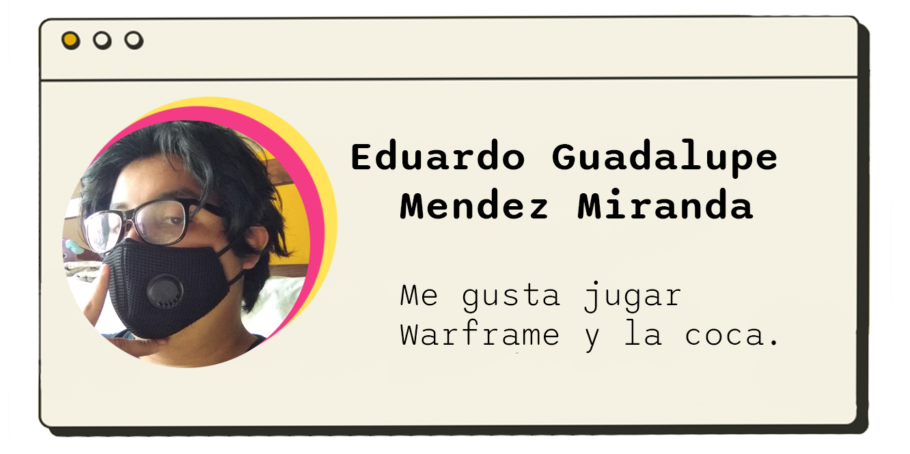
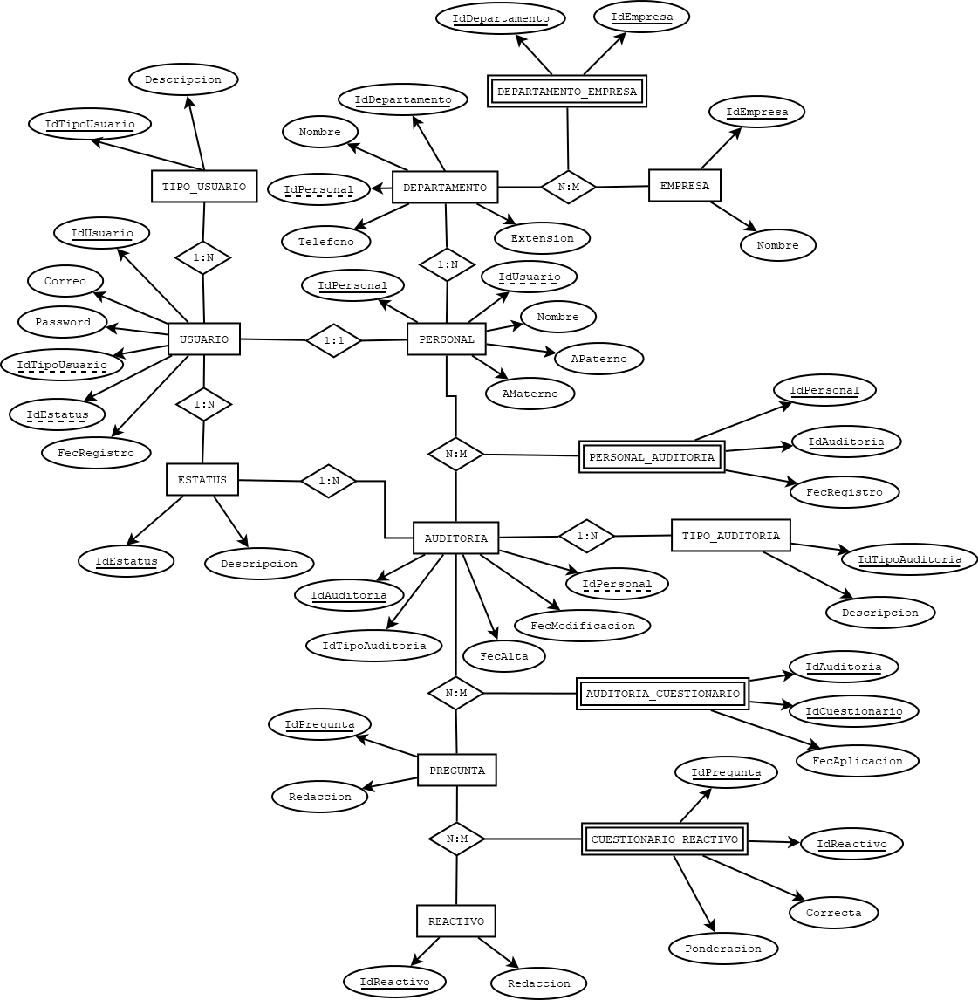
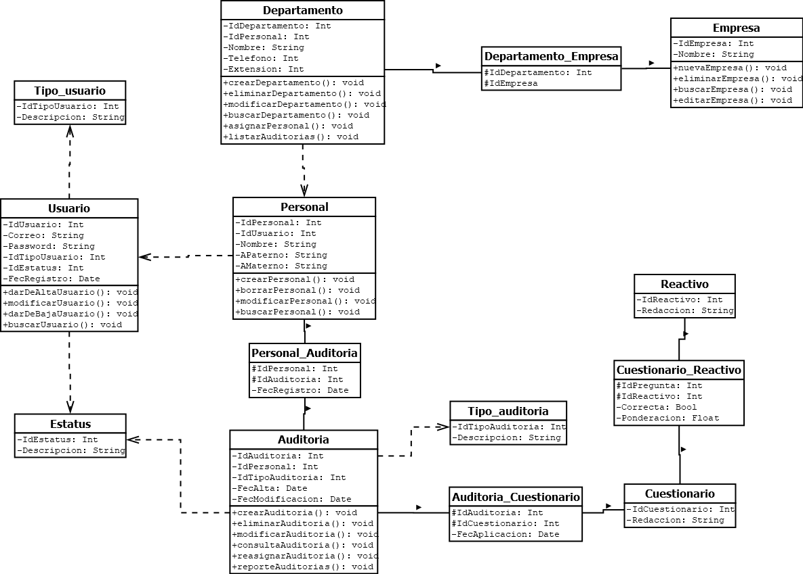

## Integrantes
<div>



</div>
<br><br><br><br><br><br><br><br><br><br><br><br><br><br><br><br><br>

## Introducción


```
----------------------------------------------------------------------
Los procesos de una empresa son fundamentales para lograr con éxito el 
resultado esperado de un producto o servicio dirigido al consumidor. 
    
Las empresas, su coordinación de sus departamentos, saber su estado s-
uele ser un punto fundamental para que se llegue el proceso adecuado 
para brindar con éxito lo que ofrecen cada empresa. 
    
Para saber que todos sus departamentos están en sincronía entre ellos 
y que estén en un mismo canal se suele aplicar auditorías a diversos 
departamentos de una empresa, pero estos procesos son algo lentos y e-
n ocasiones la misma empresa contrata a servicios externos que realic-
en esta función y correr el riesgo de no estar familiarizado con la e-
mpresa y se tome decisiones erroneas o el enfoque principal se pierda.
----------------------------------------------------------------------
```
<br>

## Propuesta Técnica


```
------------------------------------------------------------
El posesos de las auditorias antes mencionado las cuales son 
aplicadas a las empresas para la mejora continua de estas m-
ismas, pensamos como equipos que sería viable hacer una API 
para agilizar los procesos de auditorías de cualquier índol-
e aplicada en cualquier departamento de una empresa, hacer 
que el proceso de planeación de la auditorias sea más agiles, 
ayudar a ver resultados de movimientos y su desempeño en un 
lapso de tiempo.
---------------------------------------------------------
```
<br>


## Modelo Enitdad - Relacion de la DB


Se muestra las entidades, metodos y  las relaciones de la **DB** 



## Modelo Relacional





