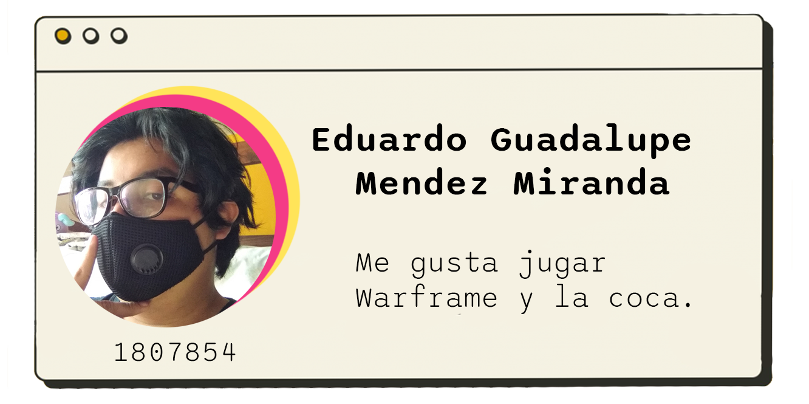

# Integrantes
<div>



</div>
<br><br><br><br><br><br><br><br><br><br><br><br><br><br><br><br>


<h1> Introducción
</h1>


```csharp

    Lorem Ipsum es simplemente el texto 
    de relleno de las imprentas y archivos 
    de texto. Lorem Ipsum ha sido el texto 
    de relleno estándar de las industrias 
    desde el año 1500, cuando un impresor 
    (N. del T. persona que se dedica a la imprenta) 
    desconocido usó una galería de textos y los mezcló 
    de tal manera que logró hacer un libro de textos 
    especimen. No sólo sobrevivió 500 años, sino que
    tambien ingresó como texto de relleno en docume-
    ntos electrónicos, quedando esencialmente igual
    al original. Fue popularizado en los con la cr-
    eación de las hojas "Letraset", las cuales co-
    ntenian pasajes de Lorem Ipsum, y más recien-
    temente con software de autoedición, como por
    ejemplo Aldus PageMaker, el cual incluye ver
    siones de Lorem Ipsum.
    ------------------------------------------
    
```
<br>
