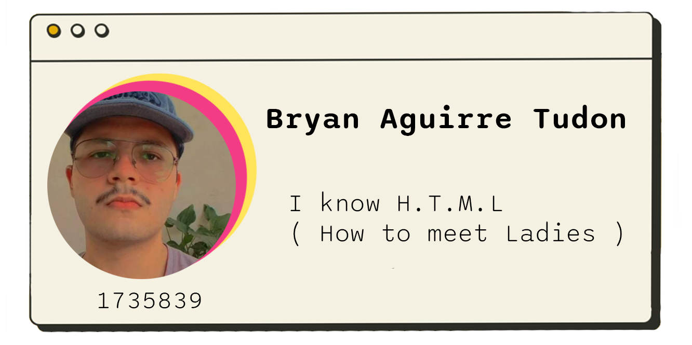

# Integrantes
<div>



</div>
<br><br><br><br><br><br><br><br><br><br><br><br><br><br><br><br>


<h1> Introducción
</h1>


```csharp
Proceso a resolver: Los procesos de una empresa son fundamentales 
    desconocido usó una galería de textos y los mezcló 

    ------------------------------------------
    
```
<br>
